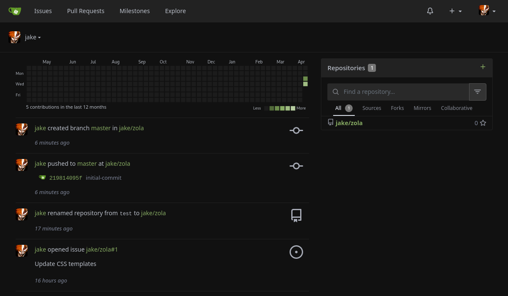
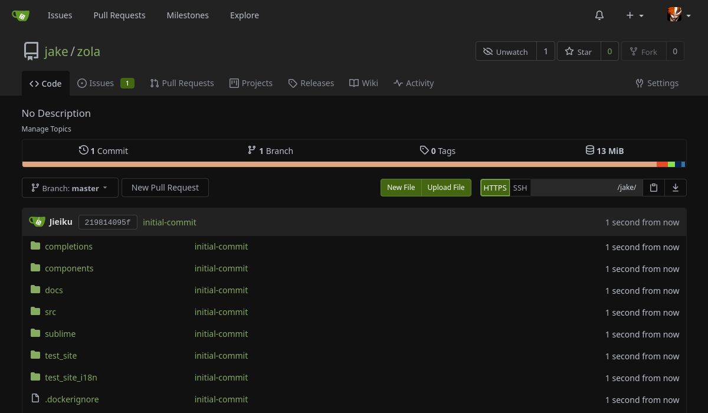
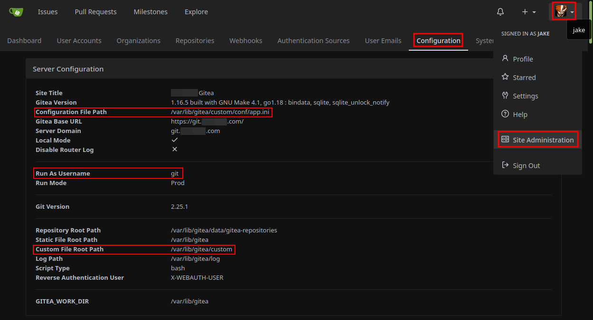

# Dark Arc
A dark theme for gitea with high contrast.

This theme was created by making a copy of theme-arc-green.css and making things darker for better contrast.

If you make improvements/tweaks to this theme please send a pull request, or dump your changes in an issue report.





## Before install, first you need to identify 3 things:

- Location of $GITEA_CUSTOM
- Location of app.ini ([Example app.ini](https://raw.githubusercontent.com/go-gitea/gitea/main/custom/conf/app.example.ini))
- User the gitea service runs as

Here is a screenshot of my environment and where to find this info:



## Create a public/assets/css directory under your gitea/custom path and download the theme.

Create `/public/assets/css` below your $GITEA_CUSTOM path, MY custom path is `/var/lib/gitea/custom`, as seen in the [install screenshot](install.png).

    sudo mkdir -p /var/lib/gitea/custom/public/assets/css
    cd /var/lib/gitea/custom/public/assets/css
    wget https://raw.githubusercontent.com/Jieiku/theme-dark-arc-gitea/main/theme-dark-arc.css

## Make sure ownership is correct:

Set ownership of your $GITEA_CUSTOM directory and files, I set ownership to git because gitea runs as user git, as seen in the [install screenshot](install.png).

    sudo chown -R git:git /var/lib/gitea/custom

## Edit the app.ini config file to include dark-arc theme:

The app.ini file location may differ depending on environment, this matches the location of my file, as seen in the [install screenshot](install.png).

`sudo nano /var/lib/gitea/custom/conf/app.ini`

    [ui]
    DEFAULT_THEME = dark-arc
    THEMES = gitea,dark-arc

## Restart gitea service

    sudo systemctl restart gitea

    *or*

    sudo reboot

The theme may automatically be active now, but if not click your avatar in top right, click settings, click appearance tab, select the theme and click update theme button.


## Notes

### assets:

As of [1.21.0](https://blog.gitea.com/release-of-1.21.0/#%EF%B8%8F-move-public-asset-files-to-the-proper-directory-25907) `/assets` now points to `custom/public/assets/*` instead of `custom/public/*`

So for me my directory structure is:

`/var/lib/gitea/custom/public/assets/css/theme-dark-arc.css`

### You can set `config` and `custom-path` values when running gitea as a service:

```shell
sudo nano /etc/systemd/system/gitea.service

ExecStart=/usr/local/bin/gitea web --custom-path /var/lib/gitea/custom --config /var/lib/gitea/custom/conf/app.ini
```

### Organizations:

I created a feature request for a way to disable organizations because I don't use them.

I was promptly told to use css and my request was closed: https://github.com/go-gitea/gitea/issues/19391

This theme hides Organizations using CSS, you can find it at the bottom of the theme:

```css
#dashboard-repo-list > div > div:first-child {
  display: none !important;
}
```
